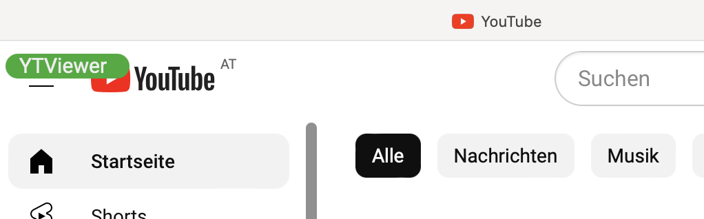
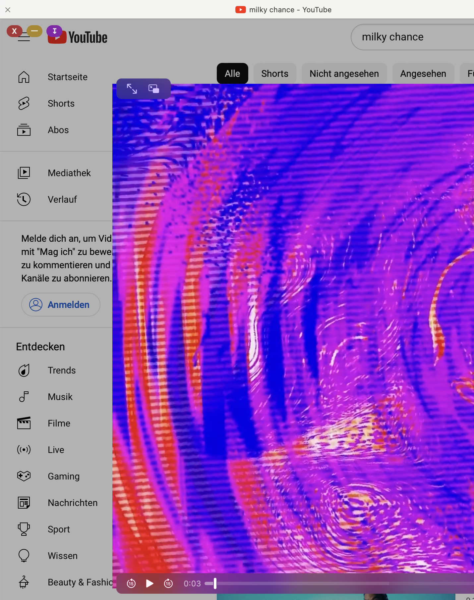

# YTViewer - A youtube.com Viewer and Download Bookmarklet

View and download ad-free youtube videos in the browser on your device (iOS supported!) - no third party service is needed.

Follow the instructions here [https://raw.githack.com/thomastschurtschenthaler/ytviewer/main/dist/ytviewer.html](https://raw.githack.com/thomastschurtschenthaler/ytviewer/main/dist/ytviewer.html) to add the bookmarklet to your device.

YTViewer uses a customized browser version of the [ytdl-core](https://www.npmjs.com/package/ytdl-core) library to resolve the youtube video links in browser.

## build instructions:
    npm install && npm run build